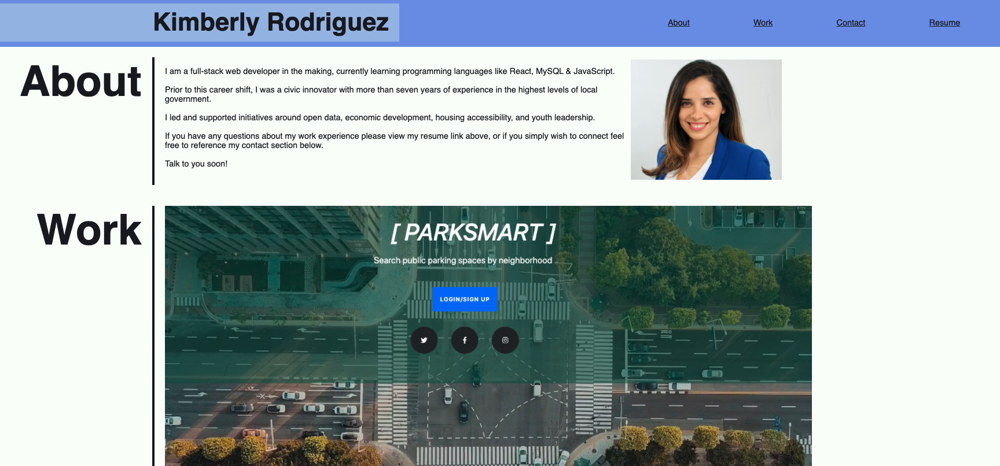

# Kimberly's Portfolio Project

## Table of Contents

* [Description](#description)
* [Installation](#installation)
* [Tools](#tools)
* [Contact](#contact)
* [License](#license)
* [Acknowledgements](#acknowledgements)

## Description  
A centralized space to showcase my work, designed for easy viewing and connection with others. Thank you for stopping by!

## Installation  
To view and deploy the portfolio, visit: [Live Site](https://kimberly-rodriguez.github.io/Kimberlys_Protfolio/).  
GitHub repository: [GitHub Link](https://github.com/Kimberly-Rodriguez/Kimberlys_Protfolio).

The following image shows the web application's appearance and functionality:

## Tools  
This project was built using HTML and CSS principles.

## Contact  
For questions or collaboration, contact me at: [krodriguez.ucla@gmail.com](mailto:krodriguez.ucla@gmail.com).

## License  
Licensed under the [MIT License](LICENSE).

