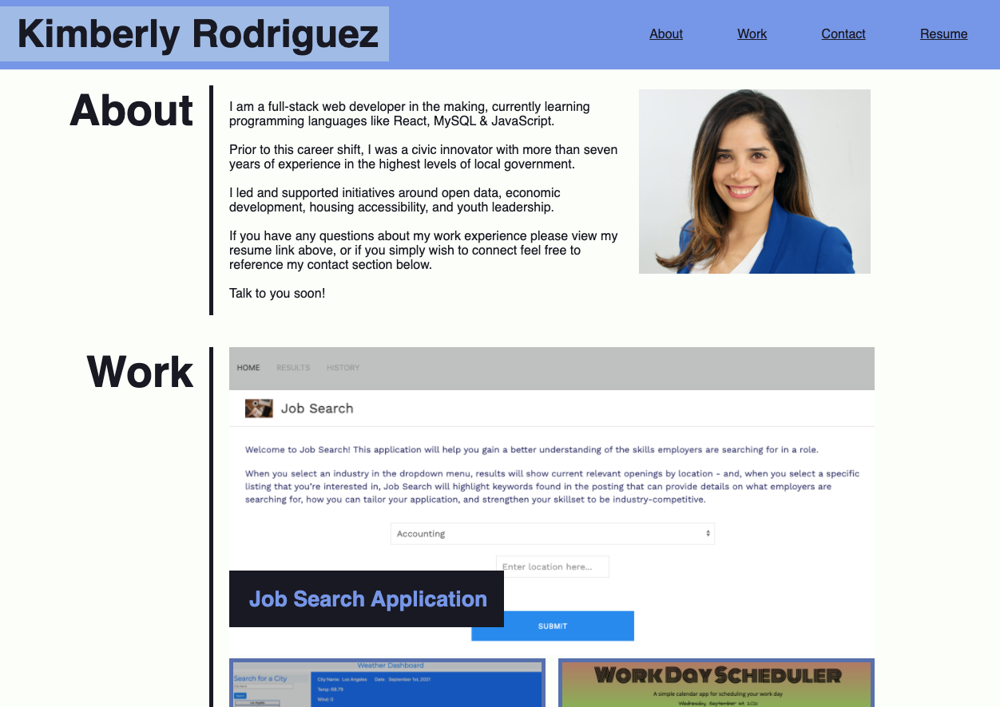

# Kimberly's Porfolio Project

# Table of Contents

* [Description](#description)
* [Instalation](#instalation)
* [Usage](#usage)
* [Tools](#tools)
* [Contact](#contact)
* [License](#license)
* [Acknowledgements](#acknowledgements)

## Description 
An apportunity to share my work in one place making it easy for any interested party to view and connect with me. I have also attached my resume, work samples, and shared my personal contact information.

I learned to built a hierarchical/order of information from document to document thus making the work easy to track. While also making my final product be more in agreement with all of its complex parts.

## Instalation:
For installation and deployment, please [click here](https://kimberly-rodriguez.github.io/Kimberlys_Protfolio/). The GitHub link is [here](https://github.com/Kimberly-Rodriguez/Kimberlys_Protfolio).

## Usage

## Tools

* This project was built using HTML and CSS principles.

## Contact

If you have any question about my work or wish to collaborate in the future please contact me at: <krodriguez.ucla@gmail.com>

## License 

Licensed under the [MIT License](LICENSE).

## Acknowledgements
* [UCLA Extension Coding Bootcamp](https://bootcamp.uclaextension.edu/coding/)
